# TemplateCode - Java - Spring - GraphQL
Autor: Leonardo Simões

Modelo de código para uma GraphQL na linguagem Java com Spring Framework e Gradle.
A aplicação possui dois recursos: MainResource e AssociatedResource.

As anotações usadas foram:
- `@Autowired` para injetar a dependência de um componente;
- `@Controller` para definir a classe que recebe e responde as requisições;
- `@Service` para as classes que implementam as regras de negócio;
- `@Repository` para as interfaces que realizam consultas ao banco de dados;
- `@QueryMapping` para metódos da controller que apenas realizam e retornam uma consulta;
- `@MutationMapping` para metódos da controller que alteram (criam, atualizam ou excluem) dados;
- `@SchemaMapping` para realizar consultas, alterações ou definir campos de dados que são objetos;
- `@Argument` para definir um parâmetro de uma operação da controller.
- `@Entity` para referenciar entidade no banco de dados;
- `@Table(name="MAINS")` para definir o nome da tabela no banco de dados;
- `@Column` para indicar que um atributo é uma coluna do banco de dados;
- `@ManyToOne` para indicar relacionamento de 1 para N;
- `@Data` (lombok) para criar getters e setters;
- `@Builder` (lombok) para criar builder;
- `@NoArgsConstructor` (lombok) para criar construtor sem argumentos;
- `@AllArgsConstructor` (lombok) para criar construtor com todos os parâmetros como argumentos.


## Etapas do desenvolvimento
As etapas de desenvolvimento do projeto foram:

1. Criar projeto (no IntelliJ) com:
- Linguagem Java (17);
- Spring Framework (6.2.3);
- Dependências: Web, GraphQL, DevTools, Lombok, JPA e H2.

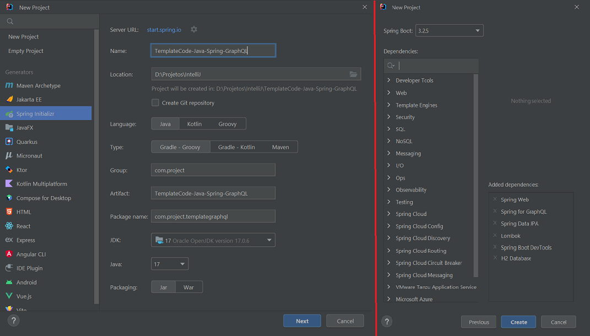

2. Alterar início da tela de Run com texto (ou imagem) personalizado:
- formatar o texto desejado usando `https://springhow.com/spring-boot-banner-generator/` e baixar `banner.txt`;

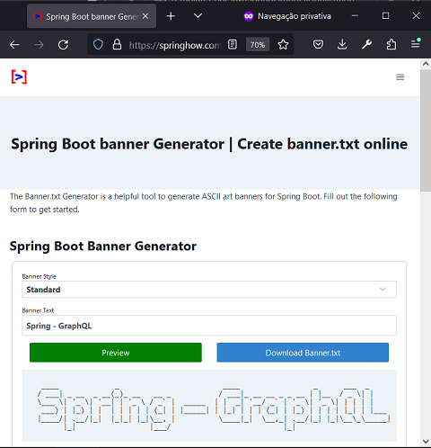

- colocar o arquivo `banner.txt` em `src/main/resources` (ou outro caminho);
- (opcional) adicionar `${spring.application.name}` e `Spring Boot ${spring-boot.formatted-version}` em `banner.txt`;
- (opcional) configurar o caminho do arquivo `banner.txt` em `application.properties`:
    * `spring.banner.location=classpath:/banner.txt`.

3. Configurar o banco de dados H2:
- Em `build.gradle` configurar de acordo com o tipo de uso desejado:
  * `implementation 'com.h2database:h2'`;
  * `runtimeOnly 'com.h2database:h2'`;
  * `testImplementation 'com.h2database:h2'`;
- Em `application.properties`:

```properties
# ================================================================
#                   APPLICATION
# ================================================================
spring.application.name=TemplateCode-Java-Spring-GraphQL
# spring.banner.location=classpath:/banner.txt
# ================================================================
#                   DATASOURCE - H2 DATABASE
# ================================================================
spring.datasource.url=jdbc:h2:mem:proddb
spring.datasource.driver-class-name=org.h2.Driver
spring.datasource.username=leo
spring.datasource.password=senha
spring.h2.console.enabled=true
spring.h2.console.path=/h2
```


- testar acesso ao console do H2 em `http://localhost:8080/h2/`:

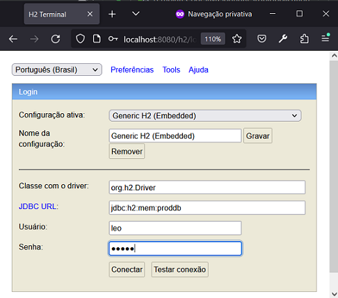

Obs.:
- Por padrão, o usename seria "sa" e a senha "", e o console do h2 estaria desativado.

4. Criar classe AssociatedEntity:
- no pacote `entities`;
- com atributos UUID id, String name;
- correspondente a tabela de nome `ASSOCIATEDS`.

5. Criar classe MainEntity:
- no pacote `entities`;
- com atributos UUID id, String name, String description e AssociatedEntity associated;
- correspondente a tabela de nome `MAINS`.

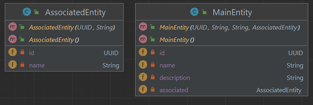

Obs.: Ao criar classes que representam entidades do banco de dados:
- anotá-las com `@Entity`, `@Table(name="...")` para mapear entidade;
- anotá-las com `@Data`, `@Builder`, `@NoArgsConstructor`, `@AllArgsConstructor` para usar o Lombok;
- adicionar atributo `UUID id` anotado com `@Id` e `@GeneratedValue(strategy = GenerationType.UUID)`;
- configurar relacionamentos com `@ManyToOne`, `@OneToMany` ou `@OneToOne` em atributos que são objetos;
- configurar as outras colunas com `@Column` e talvez algum validador como `@NotBlank` ou `@NotNull`;
- logar no console do H2 e verificar se as tabelas foram criadas corretamente:

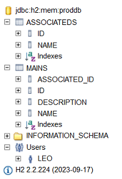

6. Criar tabelas a partir de script SQL (e não do Hibernate):
- executar a aplicação com `spring.jpa.hibernate.ddl-auto=create-drop` em `application.properties`;
- executar o comando `SCRIPT` ou (`SCRIPT TO 'D:/schema.sql'`) para obter código SQL de criação de tabelas;
- colocar o conteúdo do passo anterior em `src/main/resources/schema.sql`;
- executar a aplicação com `spring.jpa.hibernate.ddl-auto=none` e
  `spring.jpa.defer-datasource-initialization=true` em `application.properties`;

```properties
# spring.jpa.hibernate.ddl-auto=create-drop
spring.jpa.hibernate.ddl-auto=none
spring.jpa.defer-datasource-initialization=true
spring.sql.init.mode=always
```

- (opcional) configurar o caminho do arquivo `schema.sql` em `application.properties`:
  * `spring.sql.init.schema-locations=classpath:/schema.sql`.

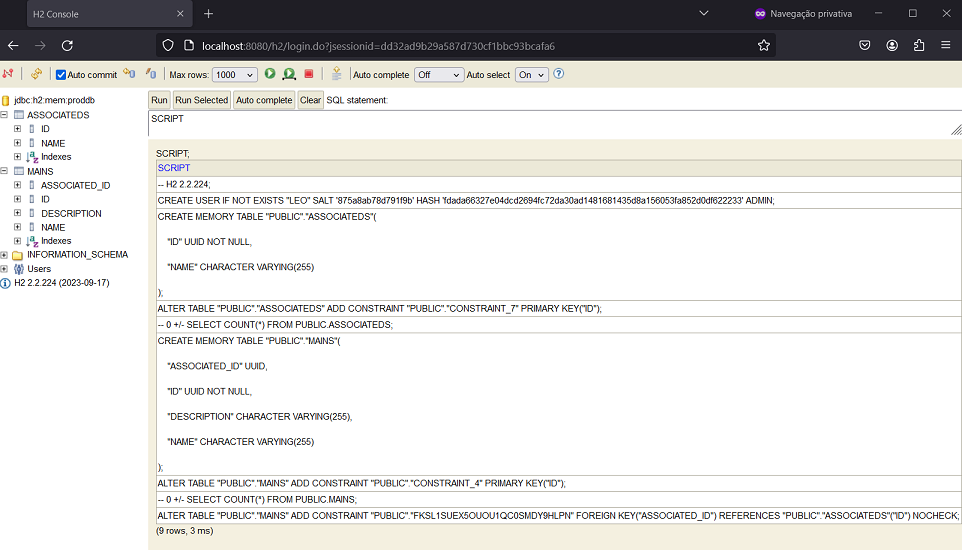

7. Criar interfaces `AssociatedRepository` e `MainRepository`:
- no pacote `repositories`;
- anotadas com `@Repository`;
- extends `JPARepository`;
- `AssociatedRepository` possue declarações dos métodos:
  * `Boolean existsByNameEqualsIgnoreCase(String name);`
  * `Optional<MainEntity> findByNameEqualsIgnoreCase(String name);`
- `MainRepository` possue declarações dos métodos:
  * `Boolean existsByNameEqualsIgnoreCase(String name);`
  * `Optional<MainEntity> findByNameEqualsIgnoreCase(String name);`
  * `List<MainEntity> findByDescriptionIsLikeIgnoreCase(String description);`
  * `List<MainEntity> findByAssociated_Name(String associated_name);`

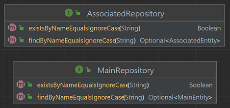

8. Criar classes dtos `AssociatedPayload` e `MainPayload`:
- no pacote `dtos`;
- anotadas com `@Data`, `@Builder`, `@NoArgsConstructor`, `@AllArgsConstructor` para usar o Lombok;

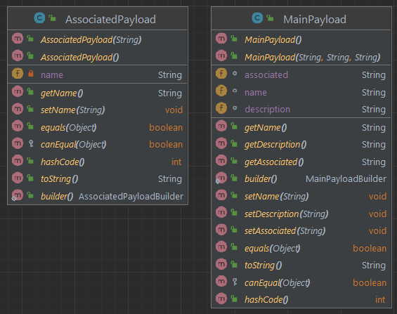

9. Criar mappers entre records ("payloads") e classes ("entities"):
- adicionar complementos em `build.gradle`:

```groovy
// compileOnly 'org.projectlombok:lombok'
implementation 'org.projectlombok:lombok'
implementation 'org.mapstruct:mapstruct:1.5.5.Final'
annotationProcessor 'org.mapstruct:mapstruct-processor:1.5.5.Final'
testAnnotationProcessor 'org.mapstruct:mapstruct-processor:1.5.5.Final'
implementation 'org.projectlombok:lombok-mapstruct-binding:0.2.0'
```

- criar as interfaces `AssociatedMapper` e `MainMapper`:
  * anotadas com `@Mapper`;
  * com atributo `INSTANCE`;
  * com 4 métodos para conversões entre entidade e payload, e entre lista de entidades e lista de payloads;
  * `MainMapper` tem dois métodos auxiliares:
    * `default AssociatedEntity toAssociated(MainPayload payload)`;
    * `default String map(AssociatedEntity associatedEntity)`;

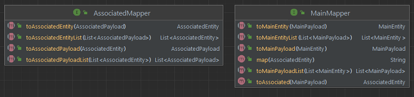

10. `Em src/main/resources/graphql`, criar `schema.graphqls` ou `schema.gqls`:
- `type Query` deve conter todos nomes de consultas;
- `type Mutation` deve conter todas as operações de criação, atualização e exclusão;
- `AssociatedInput` e `AssociatedOutput` correspondem a classe `AssociatedPayload`;
- `MainInput` e `MainOutput` correspondem a classe `MainPayload`.
- os nomes das operações e de seus parâmetros devem ser iguais aos da controller, 
  ou devem ser referenciados explicitamente;
- os nomes dos tipos de dados não precisam ser os mesmos das classes que referenciam.

```graphql
type MainOutput {
    name: String!
    description: String
    associated: AssociatedOutput
}

type AssociatedOutput {
    name: String!
}

input MainInput {
    name: String!
    description: String
    associated: AssociatedInput
}

input AssociatedInput {
    name: String!
}

type Query {
    getAllMain: [MainOutput!]!
    getMainbyName(name: String!): MainOutput
    getAllAssociated: [AssociatedOutput!]!
    getAssociatedbyName(name: String!): AssociatedOutput
}

type Mutation {
    createMain(mainInput: MainInput!): MainOutput!
    updateMain(name: String!, mainInput: MainInput!): MainOutput
    deleteMain(name: String!): Boolean
    createAssociated(associatedInput: AssociatedInput!): AssociatedOutput!
    updateAssociated(name: String!, associatedInput: AssociatedInput!): AssociatedOutput
    deleteAssociated(name: String!): Boolean
}
```

11. Criar camada de serviço:
- criar pacote `services`;
- adicionar interfaces `AssociatedService` e `MainService`;
- adicionar classes `AssociatedServiceImp` e `MainServiceImpl`:
    * anotadas com `@Service`;
    * possuem um atributo para o repository e outro para o mapper;
    * possuem um construtor com um parâmetro, mas que inicializa os dois atributos;
    * implementam as interfaces.
- os métodos `create`, `getByName`, `getAll`, `updateByName`, `deleteByName` estão nestas classes e interfaces.

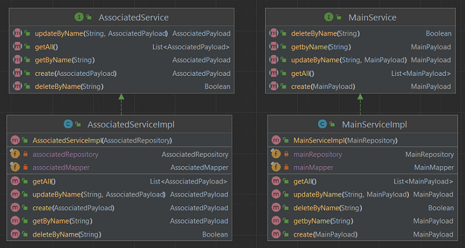

12. Criar camada de controller:
- criar pacoter `controllers`;
- adicionar classes `MainController` e `AssociatedController`:
  * anotadas com `@Controller`;
  * possuem um atributo para a service;
  * possuem um construtor anotado com `@Autowired` e com a service como parâmetro;
  * os seus métodos:
    * são anotados com `@QueryMapping` ou `@MutationMapping`;
    * tem nomes correspondentes aos em `schema.graphqls`;
    * seus parâmetros são anotados com `@Argument`;
    * tem nomes de parâmetros correspondentes aos em `schema.graphqls`;
    * os objetos de entrada e saída são das classes no pacote `dtos`.

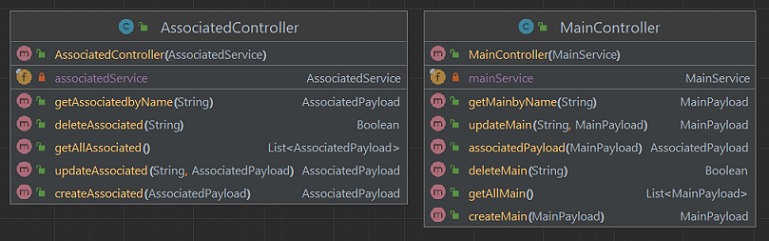


## Referências
Spring - Guides - Building a GraphQL service:
https://spring.io/guides/gs/graphql-server

Spring - Docs - Spring for GraphQL:
https://docs.spring.io/spring-graphql/reference/index.html

Baeldung - Introduction to GraphQL:
https://www.baeldung.com/graphql

Baeldung - Getting Started with GraphQL and Spring Boot: 
https://www.baeldung.com/spring-graphql

GraphQL Java - Tutorial - Getting started with Spring for GraphQL: 
https://www.graphql-java.com/tutorials/getting-started-with-spring-boot/

GraphQL.org - Learn:
https://graphql.org/learn/

Auth0 - Blog - How to Build a GraphQL API with Spring Boot:
https://auth0.com/blog/how-to-build-a-graphql-api-with-spring-boot/