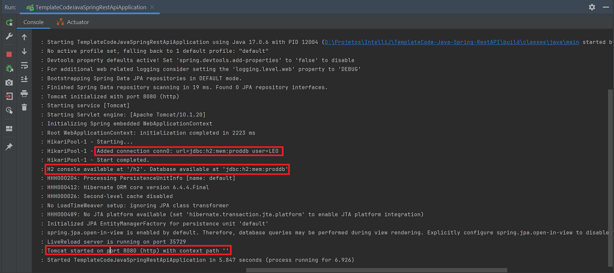
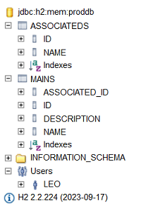
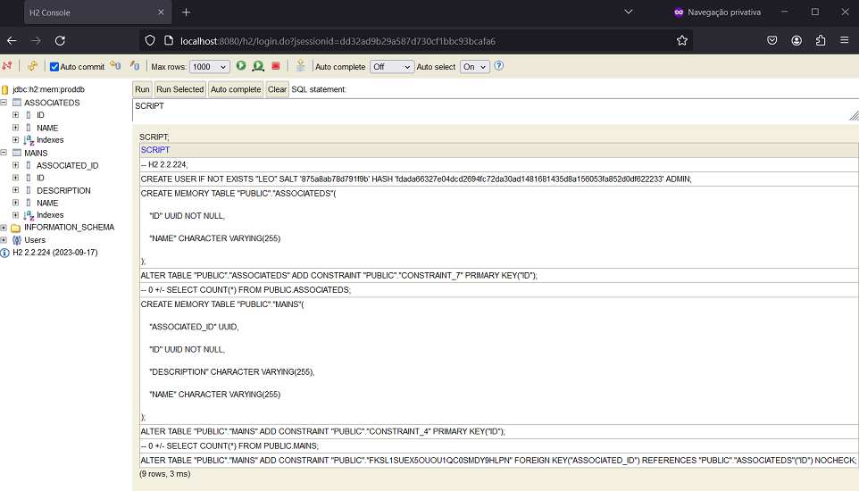
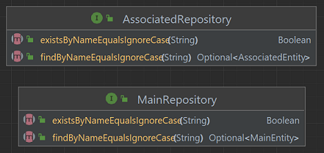
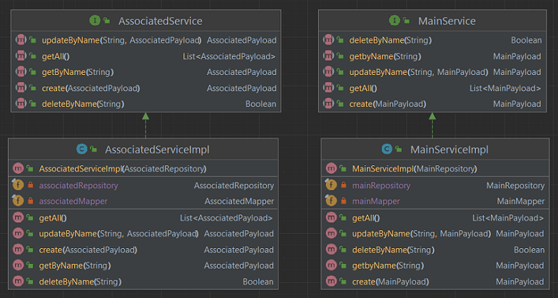
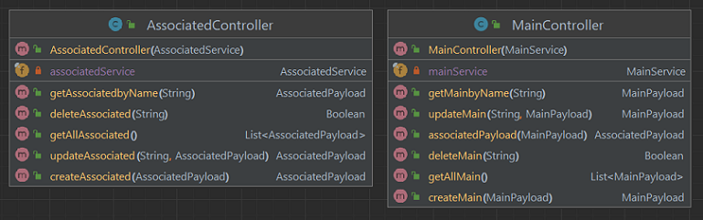

# TemplateCode - Java - Spring - GraphQL
Author: Leonardo Simões

Template Code for a GraphQL in the Java language with Spring Framework and Gradle.
The APP has two resources: MainResource and AssociatedResource.


The annotations used were:
- `@Autowired` to inject a component's dependency;
- `@Controller` to define the class that receives and responds to requests;
- `@Service` for classes that implement business rules;
- `@Repository` for interfaces that perform database queries;
- `@QueryMapping` for controller methods that only perform and return a query;
- `@MutationMapping` for controller methods that change (create, update or delete) data;
- `@SchemaMapping` to perform queries, changes or define data fields that are objects;
- `@Argument` to define a parameter of a controller operation;
- `@Entity` to reference entity in the database;
- `@Table(name="MAINS")` to define the name of the table in the database;
- `@Column` to indicate that an attribute is a database column;
- `@ManyToOne` to indicate 1 to N relationship;
- `@Data` (lombok) to create getters and setters;
- `@Builder` (lombok) to create builder;
- `@NoArgsConstructor` (lombok) to create constructor without arguments;
- `@AllArgsConstructor` (lombok) to create constructor with all parameters as arguments.


## Development steps
The project development steps were:

1. Create project (in IntelliJ) with:
- Java language (17);
- Spring Framework (6.2.3);
- Dependencies: Web, GraphQL, DevTools, Lombok, JPA and H2.


2. Change the start of the Run screen with custom text (or image):
- format the desired text using `https://springhow.com/spring-boot-banner-generator/` and download `banner.txt`;


- place the `banner.txt` file in `src/main/resources` (or another path);
- (optional) add `${spring.application.name}` and `Spring Boot ${spring-boot.formatted-version}` in `banner.txt`;
- (optional) configure the `banner.txt` file path in `application.properties`:
  * `spring.banner.location=classpath:/banner.txt`.

3. Configure the H2 database:
- In `build.gradle` configure according to the desired type of use:
* `implementation 'com.h2database:h2'`;
* `runtimeOnly 'com.h2database:h2'`;
* `testImplementation 'com.h2database:h2'`;
- In `application.properties`:

```properties
# ================================================================
#                   APPLICATION
# ================================================================
spring.application.name=TemplateCode-Java-Spring-GraphQL
# spring.banner.location=classpath:/banner.txt
# ================================================================
#                   DATASOURCE - H2 DATABASE
# ================================================================
spring.datasource.url=jdbc:h2:mem:proddb
spring.datasource.driver-class-name=org.h2.Driver
spring.datasource.username=leo
spring.datasource.password=senha
spring.h2.console.enabled=true
spring.h2.console.path=/h2
```



- test access to the H2 console at `http://localhost:8080/h2/`:


Note:
- By default, the usename would be "sa" and the password "", and the h2 console would be disabled.

4. Create AssociatedEntity class:
- in the `entities` package;
- with attributes UUID id, String name;
- corresponding to the table named `ASSOCIATEDS`.

5. Create MainEntity class:
- in the `entities` package;
- with UUID id, String name, String description and AssociatedEntity associated attributes;
- corresponding to the table named `MAINS`.


Note: When creating classes that represent database entities:
- annotate them with `@Entity`, `@Table(name="...")` to map entity;
- annotate them with `@Data`, `@Builder`, `@NoArgsConstructor`, `@AllArgsConstructor` to use Lombok;
- add attribute `UUID id` annotated with `@Id` and `@GeneratedValue(strategy = GenerationType.UUID)`;
- configure relationships with `@ManyToOne`, `@OneToMany` or `@OneToOne` in attributes that are objects;
- configure the other columns with `@Column` and perhaps some validator like `@NotBlank` or `@NotNull`;
- log into the H2 console and check if the tables were created correctly:



6. Create tables from SQL script (not from Hibernate):
- run the application with `spring.jpa.hibernate.ddl-auto=create-drop` in `application.properties`;
- execute the command `SCRIPT` or (`SCRIPT TO 'D:/schema.sql'`) to obtain SQL code for creating tables;
- place the content of the previous step in `src/main/resources/schema.sql`;
- run the application with `spring.jpa.hibernate.ddl-auto=none` and
  `spring.jpa.defer-datasource-initialization=true` in `application.properties`;

```properties
# spring.jpa.hibernate.ddl-auto=create-drop
spring.jpa.hibernate.ddl-auto=none
spring.jpa.defer-datasource-initialization=true
spring.sql.init.mode=always
```

- (optional) configure the `schema.sql` file path in `application.properties`:
  * `spring.sql.init.schema-locations=classpath:/schema.sql`.



7. Create `AssociatedRepository` and `MainRepository` interfaces:
- in the `repositories` package;
- annotated with `@Repository`;
- extends `JPARepository`;
- `AssociatedRepository` has method declarations:
  * `Boolean existsByNameEqualsIgnoreCase(String name);`
  * `Optional<MainEntity> findByNameEqualsIgnoreCase(String name);`
- `MainRepository` has method declarations:
  * `Boolean existsByNameEqualsIgnoreCase(String name);`
  * `Optional<MainEntity> findByNameEqualsIgnoreCase(String name);`
  * `List<MainEntity> findByDescriptionIsLikeIgnoreCase(String description);`
  * `List<MainEntity> findByAssociated_Name(String associated_name);`



8. Create dtos classes `AssociatedPayload` and `MainPayload`:
- in the `dtos` package;
- annotated with `@Data`, `@Builder`, `@NoArgsConstructor`, `@AllArgsConstructor` to use Lombok;


9. Create mappers between records ("payloads") and classes ("entities"):
- add addons in `build.gradle`:

```groovy
// compileOnly 'org.projectlombok:lombok'
implementation 'org.projectlombok:lombok'
implementation 'org.mapstruct:mapstruct:1.5.5.Final'
annotationProcessor 'org.mapstruct:mapstruct-processor:1.5.5.Final'
testAnnotationProcessor 'org.mapstruct:mapstruct-processor:1.5.5.Final'
implementation 'org.projectlombok:lombok-mapstruct-binding:0.2.0'
```

- create the `AssociatedMapper` and `MainMapper` interfaces:
  * annotated with `@Mapper`;
  * with `INSTANCE` attribute;
  * with 4 methods for conversions between entity and payload, and between list of entities and list of payloads;
  * `MainMapper` has two helper methods:
    * `default AssociatedEntity toAssociated(MainPayload payload)`;
    * `default String map(AssociatedEntity associatedEntity)`;


10. `In src/main/resources/graphql`, create `schema.graphqls` or `schema.gqls`:
- `type Query` must contain all query names;
- `type Mutation` must contain all creation, update and deletion operations;
- `AssociatedInput` and `AssociatedOutput` correspond to the `AssociatedPayload` class;
- `MainInput` and `MainOutput` correspond to the `MainPayload` class.
- the names of operations and their parameters must be the same as those in the controller,
  or must be explicitly referenced;
- the names of data types do not need to be the same as the classes they reference.

```graphql
type MainOutput {
    name: String!
    description: String
    associated: AssociatedOutput
}

type AssociatedOutput {
    name: String!
}

input MainInput {
    name: String!
    description: String
    associated: AssociatedInput
}

input AssociatedInput {
    name: String!
}

type Query {
    getAllMain: [MainOutput!]!
    getMainbyName(name: String!): MainOutput
    getAllAssociated: [AssociatedOutput!]!
    getAssociatedbyName(name: String!): AssociatedOutput
}

type Mutation {
    createMain(mainInput: MainInput!): MainOutput!
    updateMain(name: String!, mainInput: MainInput!): MainOutput
    deleteMain(name: String!): Boolean
    createAssociated(associatedInput: AssociatedInput!): AssociatedOutput!
    updateAssociated(name: String!, associatedInput: AssociatedInput!): AssociatedOutput
    deleteAssociated(name: String!): Boolean
}
```

11. Create service layer:
- create `services` package;
- add `AssociatedService` and `MainService` interfaces;
- add classes `AssociatedServiceImp` and `MainServiceImpl`:
  * annotated with `@Service`;
  * have an attribute for the repository and another for the mapper;
  * have a constructor with one parameter, but which initializes both attributes;
  * implement the interfaces.
- the methods `create`, `getByName`, `getAll`, `updateByName`, `deleteByName` are in these classes and interfaces.



12. Create controller layer:
- create `controllers` package;
- add `MainController` and `AssociatedController` classes:
  * annotated with `@Controller`;
  * have an attribute for service;
  * have a constructor annotated with `@Autowired` and with service as a parameter;
  * its methods:
    * are annotated with `@QueryMapping` or `@MutationMapping`;
    * has names corresponding to those in `schema.graphqls`;
    * its parameters are annotated with `@Argument`;
    * has parameter names corresponding to those in `schema.graphqls`;
    * input and output objects are from classes in the `dtos` package.




## References
Spring - Guides - Building a GraphQL service:
https://spring.io/guides/gs/graphql-server

Spring - Docs - Spring for GraphQL:
https://docs.spring.io/spring-graphql/reference/index.html

Baeldung - Introduction to GraphQL:
https://www.baeldung.com/graphql

Baeldung - Getting Started with GraphQL and Spring Boot:
https://www.baeldung.com/spring-graphql

GraphQL Java - Tutorial - Getting started with Spring for GraphQL:
https://www.graphql-java.com/tutorials/getting-started-with-spring-boot/

GraphQL.org - Learn:
https://graphql.org/learn/

Auth0 - Blog - How to Build a GraphQL API with Spring Boot:
https://auth0.com/blog/how-to-build-a-graphql-api-with-spring-boot/